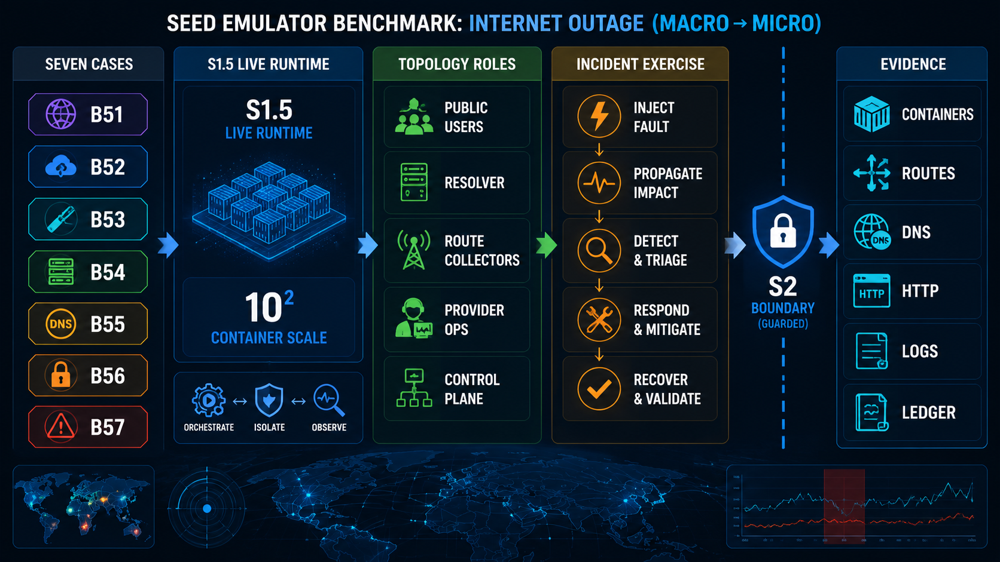
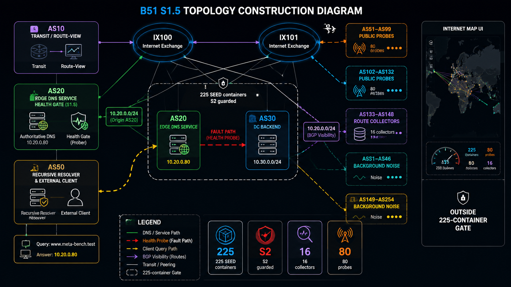
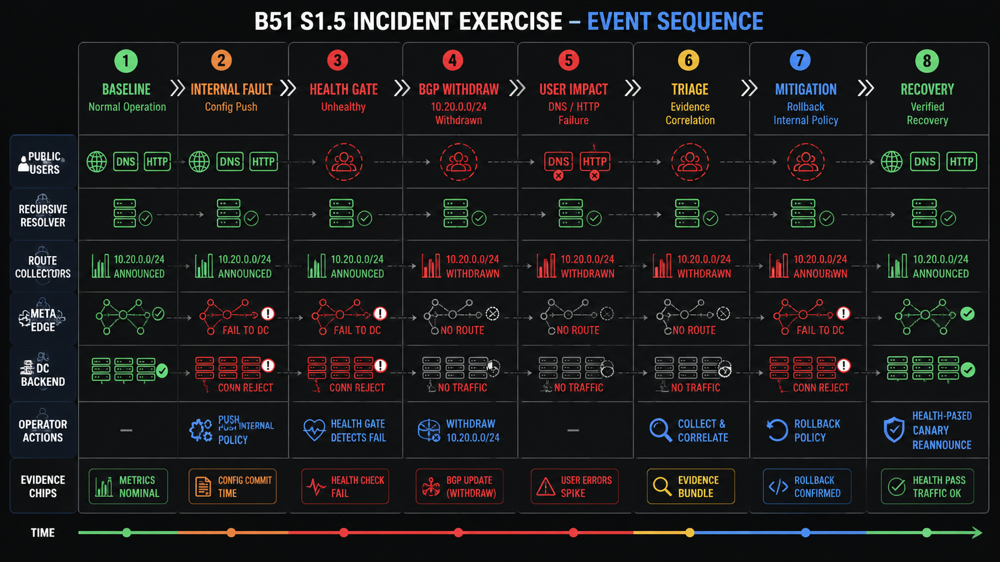

# Internet Outage Benchmark Showcase Materials

## Showcase Target

| Item | Fact |
|---|---|
| case set | B51-B57, independent examples under `examples/internet/` |
| live tier | S1.5, 177-225 topology containers per case |
| exercise shape | baseline, impact, user/frontline, provider triage, change audit, mitigation, recovery verification, postmortem |
| operator boundary | role observations and bounded actions; no client-host edits, oracle edits, root-service kills, or forced unhealthy recovery |
| UI surfaces | case panel for all cases; Internet Map for B51 |
| S2 | preflight-only on this host |

## Material Map

| Material | File | Use |
|---|---|---|
| showcase matrix | [internet_outage_case_implementation.md](internet_outage_case_implementation.md) | scale, panels, mechanism, first observation, code entry |
| live evidence record | [cases_02_07_s1_5_validation.md](cases_02_07_s1_5_validation.md) | accepted S1.5 commands, counts, evidence, boundaries |
| design rules | [showcase_design_principles.md](showcase_design_principles.md) | document and visual standard |
| seven-case overview image | [internet_outage_cases_overview.png](assets/internet_outage_cases_overview.png) | quick opening overview |
| macro-to-micro image | [internet_outage_macro_to_micro.png](assets/internet_outage_macro_to_micro.png) | whole benchmark structure |
| B51 S1.5 topology image | [internet_outage_b51_s1_5_topology.png](assets/internet_outage_b51_s1_5_topology.png) | concrete large live topology |
| B51 incident sequence image | [internet_outage_b51_incident_sequence.png](assets/internet_outage_b51_incident_sequence.png) | normal, fault, triage, recovery order |

## Seven-Case View

| Case | S1.5 Gate | Mechanism | What Viewers See | Recovery Gate |
|---|---:|---|---|---|
| B51 Meta cascade | 225/225 | edge-to-DC failure triggers health-gated BGP withdrawal | DNS/service failure, missing `10.20.0.0/24`, unhealthy edge gate | backend health, canary reannounce, public DNS/HTTP |
| B52 S3 control plane | 182/180 | maintenance removes index and placement capacity | API 503, object shards healthy, registry root cause | freeze, restore index, restore placement, canary PUT |
| B53 edge config bug | 186/185 | valid config triggers POP runtime bug | 7/8 POP failures, healthy origins, valid compiler path | distribution freeze, rollback, POP canary |
| B54 feature file proxy | 191/190 | feature-file expansion breaks core proxy | core/tail 5xx, bad size/hash, healthy origins | stop generation, known-good rollback, fail-small |
| B55 route leak | 177/177 | more-specific leak propagates through Verizon path | unfiltered probes learn `10.55.0.0/25`, filtered probes reject it | withdraw leak, convergence, aggregate reachability |
| B56 DNS DDoS | 178/178 | authoritative path overload, not DNS process kill | fresh Dyn lookups fail, `named` alive, secondary DNS works | scrubber/rate limit, cache-miss lookup, HTTP |
| B57 control-plane deschedule | 194/194 | automation drops network control-plane jobs | external route withdrawn, curl `000`, workloads local healthy | halt automation, reschedule, distribute config, regional verify |

## How To Use The Images

| Image | Point At | Say | Then Show |
|---|---|---|---|
| seven-case overview | seven lanes and S1.5 gates | each case has a distinct outage mechanism and a measured live container gate | case row in [internet_outage_case_implementation.md](internet_outage_case_implementation.md) |
| macro-to-micro | left-to-right stack | benchmark family becomes a live runtime, role views, gated actions, and collected evidence | `test_log/runtime/S1_5/` artifact tree |
| B51 topology | AS20 edge, AS30 DC, AS50 resolver/probe, probes, collectors, background ASes | the visible failure is public DNS/service loss; the root cause is internal edge-to-DC reachability | Internet Map at `http://127.0.0.1:8080/pro/home` |
| B51 sequence | health gate and BGP withdrawal steps | the prefix disappears only after the edge gate detects backend failure | `bash b51ctl.sh fault-runtime S1.5` output and collector artifacts |

## Macro To Micro

Read the image from left to right:

| Layer | What To Point At |
|---|---|
| case family | seven outage mechanisms, one common intervention contract |
| runtime tier | S1.5 is the live showcase target; S2 is preflight-only |
| topology | clients, provider internals, control plane, route/DNS views |
| exercise | baseline, impact, triage, change audit, mitigation, verification |
| evidence | container count, route/DNS/control artifacts, ledger, collect, down |

## B51 S1.5 Construction

| Role | Runtime Fact |
|---|---|
| AS10 | external transit and route-view path |
| AS20 | edge authoritative DNS, service entry, health gate |
| AS30 | internal DC/backend dependency |
| AS50 | recursive resolver and external probe |
| AS51-AS99, AS102-AS132 | S1.5 public probe routers |
| AS133-AS148 | S1.5 route collector routers |
| AS31-AS46, AS149-AS254 | S1.5 background-noise routers |
| Internet Map | optional UI aid; not counted in the 225-container gate |

Code entry:

| File | Shows |
|---|---|
| [meta_style_cascade.py](../examples/internet/B51_meta_style_cascade/meta_style_cascade.py) | AS roles, IX layout, DNS/Web services, probe and collector routers |
| [b51ctl.sh](../examples/internet/B51_meta_style_cascade/b51ctl.sh) | normal, fault, observe, action, recovery, map and panel commands |
| [case_metadata.json](../examples/internet/B51_meta_style_cascade/case_metadata.json) | domain, prefixes, S1.5 scale, roles, evidence |
| [agent_policy.json](../examples/internet/B51_meta_style_cascade/agent_policy.json) | allowed observations and forbidden shortcuts |

## B51 Incident Sequence

| Phase | Presenter Focus | Runtime Evidence |
|---|---|---|
| baseline | public DNS/HTTP, route visibility, edge health all green | DNS answer `10.20.0.80`, HTTP 200, route `10.20.0.0/24`, health `healthy` |
| inject fault | internal edge-to-DC path or policy fails | action log for `inject-fault` |
| gate | health gate marks backend unreachable | health observation changes to `unhealthy` |
| withdraw | edge DNS/service prefix disappears from external BGP views | route collector reports missing `10.20.0.0/24` |
| impact | users and resolvers see DNS and service failure | public-user DNS/HTTP observations fail |
| triage | compare users, resolver, route collectors, edge health, backend | role observation files under `exercise/<id>/observations/` |
| mitigation | rollback internal policy; do not force an unhealthy announcement | action log for `rollback-internal-policy` |
| verification | health recovers, canary reannounces, public probes pass | `verify-health`, `canary-reannounce`, `validate-recovery`, `recovery-runtime` |

## Live Screen Order

| Step | Screen | Command Or Path |
|---|---|---|
| 1 | case matrix | [internet_outage_case_implementation.md](internet_outage_case_implementation.md) |
| 2 | B51 map | `http://127.0.0.1:8080/pro/home` after map-enabled generation |
| 3 | B51 panel | `bash b51ctl.sh panel-runtime S1.5 8510` |
| 4 | baseline evidence | `bash b51ctl.sh normal-runtime S1.5` |
| 5 | fault evidence | `bash b51ctl.sh inject-fault-runtime S1.5` then `bash b51ctl.sh fault-runtime S1.5` |
| 6 | role observations | `bash b51ctl.sh exercise-observe-runtime S1.5 <role>` |
| 7 | recovery | `bash b51ctl.sh exercise-action-runtime S1.5 rollback-internal-policy` then recovery checks |
| 8 | collected proof | `test_log/runtime/S1_5/` |

## Proof To Show

| Claim | Proof Surface |
|---|---|
| live topology, not static telemetry | `runtime_container_count.txt`, `docker ps`, generated `output/docker-compose.yml` |
| multi-role incident | observation files for users, frontline, provider ops, network/control plane |
| bounded intervention | `agent_policy.json`, `exercise-gate-runtime`, action result files |
| B51 mechanism | health-gated BGP withdrawal after edge-to-DC failure |
| B56 mechanism | fresh lookups fail while `named` stays alive |
| recovery proof | canary, cache-miss lookup, route convergence, or service validation per case |
| S2 boundary | `s2-preflight`; no default S2 live run on this host |

## Demo Timing

| Target | Runtime | Measured Time |
|---|---:|---:|
| B51 map-enabled up | 225 topology + 1 map container | `2:22.23` |
| B51 down | 225 topology + 1 map container | `1:21.47` |
| B52 full smoke | 182 topology containers | `4:04.28` |
| B53 full smoke | 186 topology containers | `4:01.87` |
| B54 full smoke | 191 topology containers | `4:08.73` |
| B55 full smoke | 177 topology containers | `4:21.13` |
| B56 full smoke | 178 topology containers | `5:30.82` |
| B57 full smoke | 194 topology containers | `4:45.37` |

## Closing Checklist

| Show | Done When |
|---|---|
| live scale | panel and `runtime_container_count.txt` show the S1.5 gate |
| normal state | external users and provider views agree on healthy service |
| fault | user-visible failure appears after the case-specific mechanism |
| triage | role observations narrow the root cause without privileged shortcuts |
| recovery | bounded action restores service and external validation passes |
| cleanup | containers and networks for the compose project are gone |
