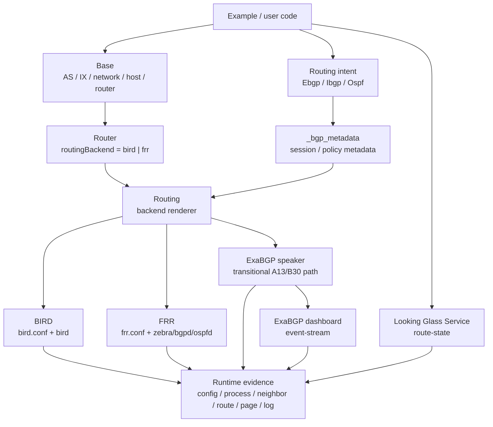

# SEED Control Plane Showcase Design

这份文档只保留明天展示需要讲清楚的内容：最新设计口径、已修的问题、运行证据、仍然存在的设计边界。现场命令放在 [SEED_emulator_agent_playbook.md](../developer_manual/SEED_emulator_agent_playbook.md)。

## 1. 最新设计口径

- BIRD/FRR 是真实 `Router` control-plane backend。默认仍是 BIRD；FRR 在创建 router 时选择：`createRouter("r2", routingBackend="frr")`。
- `Ebgp`、`Ibgp`、`Ospf` 只记录协议 intent：peer、relationship、route policy、OSPF interface。
- `Routing` 负责把 intent 渲染到具体 daemon：BIRD 配 `/etc/bird/bird.conf`，FRR 配 `/etc/frr/frr.conf`。
- ExaBGP 是 control-plane speaker/service/host，用来 peer、announce、withdraw、observe、emit events。它不是 BIRD/FRR 这种完整 transit router backend。当前 A13/B30 的 `routingBackend="exabgp"` 是过渡实现，只用于证明 IX-facing speaker 的运行价值。
- Looking Glass 是观察 Service。Classic LG 是 route-state view；ExaBGP dashboard 是 event-stream view，两个语义分开讲。
- B29 Email 当前能演示 DNS/MX/Roundcube/跨域投递，但 `EmailService` 仍是 Docker compiler helper，不是最终的标准 Service/Binding API。

## 2. 设计图

## 3. 本轮已处理的问题

| 问题 | 处理结果 |
| --- | --- |
| ExaBGP 进容器后 `exabgpcli` 找不到 pipe | 生成 `/run/exabgp.in`、`/run/exabgp.out`，启用 `exabgp.api.cli=true`，同时保留 `/run/exabgp/live.in` |
| ExaBGP dashboard 能打开但 JSON event 文件可能为空 | live FIFO 的 ready/announce/withdraw 同步写入 `/var/log/exabgp/events.jsonl`，dashboard API 合并 native ExaBGP log 和 live-control event |
| A13/B30 只证明“安装了 ExaBGP”不够 | 已验证静态前缀和 live announce/withdraw 都能让 peer route table 真实变化 |
| A14 route-state 和 event-stream 容易混讲 | 文档和命令明确 `5002` 是 Classic LG route-state，`5003` 是 ExaBGP event dashboard |
| Looking Glass FRR 路径不能继续等待 BIRD socket | route-state proxy 根据 router backend 等待 BIRD socket 或 FRR/vtysh |
| B29 生成和测试不稳 | 修复 `email_realistic.py` 语法错误、`b29ctl.sh test` 参数转发、旧 Map URL、旧机器路径 |
| B29 容器/网络命名容易串台 | `b29ctl.sh` 默认 `COMPOSE_PROJECT_NAME=b29`，Roundcube 外部网络跟随同一个 project name |
| WSL 本机没有 `docker compose` plugin | playbook 主路径统一使用 `docker-compose` 和 `DOCKER_BUILDKIT=0 COMPOSE_DOCKER_CLI_BUILD=0` |

## 4. 验证矩阵

2026-05-30 已在 WSL + Docker 环境逐个重新生成、build、up、检查、down。每次只保留一个实验在线。

| 例子 | 拓扑一句话 | 证明点 | 核心证据 | 状态 |
| --- | --- | --- | --- | --- |
| A12 | AS2 内部 BIRD/FRR 混合，AS151 是 FRR stub，AS152 是 BIRD stub | FRR 是 Router backend，不是运行时手补；BIRD/FRR 能互通 | FRR Dockerfile 安装 `frr`；FRR 节点无 BIRD；`frr.conf`；`vtysh` BGP/OSPF；`birdc`；AS path、next-hop、community、local-pref | PASS |
| A13 | AS180 ExaBGP speaker 直连 IX100，peer AS2/router0 | ExaBGP 能作为 IX-facing speaker 在线注入/撤销前缀 | `exabgp.conf`；native pipe；`live.in`；AS2 学到 `198.51.100.0/24`；`exabgpcli` 和 FIFO live route 出现/消失；`events.jsonl` 有 live-control JSON；dashboard/log | PASS |
| B30 | B00 mini Internet 加 AS180 ExaBGP speaker，peer AS2/r100 和 AS3/r100 | ExaBGP 在规模拓扑里对多个真实 router 生效 | AS2/AS3 session Established；静态 `203.0.113.0/24`、`203.0.114.0/24`；live route 在两个 peer 出现/消失；`events.jsonl`；`5106` dashboard；Map | PASS |
| A14 | AS2/router0 被 Classic LG 观察，AS151/event-viewer 展示 ExaBGP events | route-state 和 event-stream 是两个独立能力 | `5002/api/state` 返回 BIRD protocols/routes 和 live route；`5003/api/events` 返回 ready/announce/withdraw；route table 与页面一致 | PASS |
| B29 | 多 ISP、多 IX、多邮件域，DNS MX + Roundcube | Email demo 能支撑 service-ops 展示 | DNS cache 解析 MX；6 个 mailserver；Roundcube `8082`；默认矩阵 `12/12`，全量六域 `30/30`；mail logs 有 delivery 证据 | PASS |

## 5. 当前设计边界

| 组件 | 当前可展示 | 仍需下一步收敛 |
| --- | --- | --- |
| BIRD/FRR | Router backend 设计成立，A12 已验证 runtime 语义 | 补 CI behavior test：BIRD/FRR 双路径、route attribute、默认 BIRD 回归 |
| ExaBGP | A13/B30 能证明 IX-facing speaker、native CLI、FIFO、event dashboard | 把 public API 从 `routingBackend="exabgp"` 迁到明确的 speaker/service API：install、bind、attach、peer、announce、withdraw |
| Looking Glass | A14 已证明 BIRD route-state view 和 ExaBGP event-stream view | FRR-backed LG 只作为预留路径，未单独验证前不作为现场 claim |
| Email | B29 可作为运行态 service-ops 展示 | `EmailService` 要从 compiler helper 升级为标准 Service/Binding |
| Agent harness | 能做 read-only takeover，识别 runtime inventory、routing、logs、pages | 下一步做 incident platform：fault injection、controlled repair、oracle scoring |

## 6. 现场讲法

1. 先打开 Map 讲拓扑，指出谁是 router、谁是 service、谁是 speaker。
2. 再进容器看 config/process，证明能力来自 SEED 生成结果。
3. 查 neighbor/route/attribute，证明协议真的收敛。
4. 查 page/API/log，证明可视化语义正确。
5. 最后回代码，只讲生态入口：Router backend、protocol intent、Routing renderer、Service Binding。
