# SEED 智能体与网络实验平台图文总览

## 工作全景

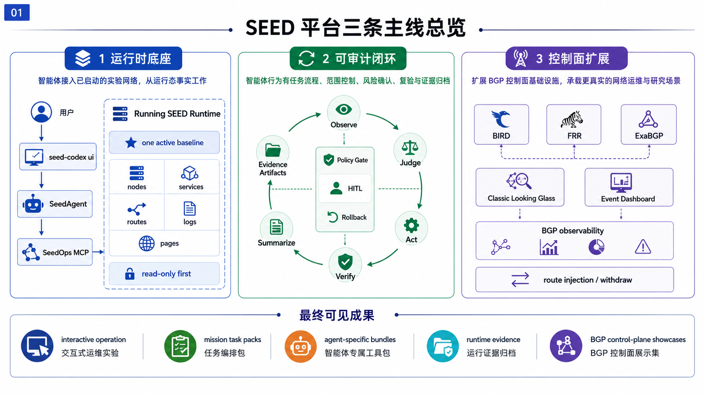

SEED Emulator 的能力边界已经从“生成可运行网络实验”扩展到“运行态网络实验平台”。当前体系覆盖三条主线：

| 主线 | 核心能力 | 可展示结果 |
|---|---|---|
| 智能体运行时底座 | 接管已经启动的 SEED 网络，读取节点、服务、路由、日志和页面状态 | `seed-codex ui` 面向当前唯一在线 runtime 进行交互式运维 |
| 可审计智能体闭环 | 观察、判断、动作、验证、总结、证据归档 | 任务报告可追溯到 job steps、artifacts、logs、routes、pages |
| BGP 控制面扩展 | BIRD/FRR、ExaBGP、Looking Glass、事件 dashboard | A12/A13/A14/B30 形成 BGP 控制面验证和演示主线 |

平台现在强调运行态事实。智能体面对的是已经启动的网络，通过受控工具面理解环境、定位问题、执行有限动作、复验结果。示例名称和 output 路径只作为接入提示；判断依据来自运行时证据。

## seed-codex 激活链

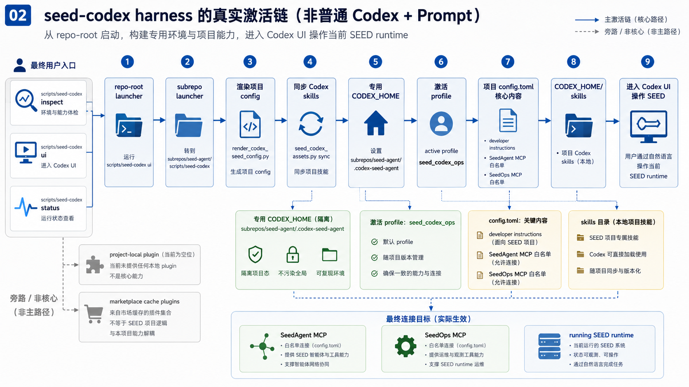

`seed-codex` 的项目特化来自专用 harness，而非普通命令包装。启动链路如下：

| 环节 | 位置 | 作用 |
|---|---|---|
| repo-root launcher | `scripts/seed-codex` | 用户统一入口 |
| subrepo launcher | `subrepos/seed-agent/scripts/seed-codex` | 启动 SeedOps、SeedAgent、Codex |
| config renderer | `subrepos/seed-agent/scripts/render_codex_seed_config.py` | 生成项目专用 `config.toml` |
| assets sync | `subrepos/seed-agent/scripts/seed_codex_assets.py sync` | 同步项目 Codex skills |
| CODEX_HOME | `subrepos/seed-agent/.codex-seed-agent` | 项目隔离的 Codex 运行目录 |
| active profile | `seed_codex_ops` | 绑定项目提示词、MCP、skills |
| MCP surfaces | SeedAgent MCP、SeedOps MCP | 高层任务编排与底层运行时工具 |

现场可见入口：

```bash
scripts/seed-codex status
scripts/seed-codex inspect
scripts/seed-codex ui -m gpt-5.4 -c 'model_reasoning_effort="low"'
```

`inspect` 用来展示当前激活的 `CODEX_HOME`、`config.toml`、MCP 工具白名单、Codex skills。当前主路径没有项目自定义 plugin；项目特化依赖 `config.toml + MCP + Codex skills`。

**展示重点**：这里讲的是“智能体为什么会以 SEED 操作者身份工作”。`seed-codex ui` 启动前会刷新项目配置和 skills，进入的是隔离的 `CODEX_HOME`，因此模型看到的不只是用户的一句话，还包括项目级角色定位、工具边界、MCP 入口和行为约束。现场可以先跑 `inspect`，再进入 UI，让观众看到 harness 是可检查的工程面，而不是口头约定。

## Agent / MCP / Runtime 分层

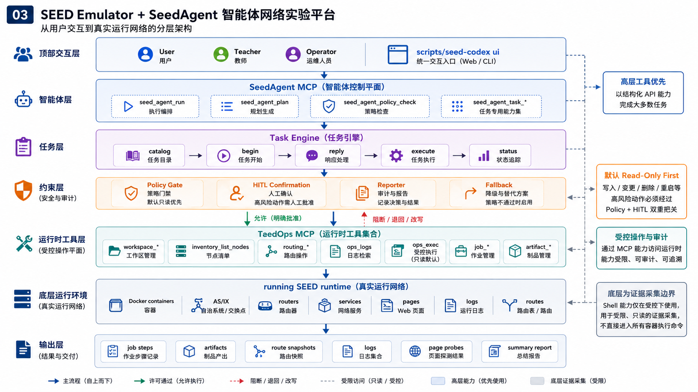

运行链路按职责分层：

| 层 | 组件 | 职责 |
|---|---|---|
| 用户交互层 | `seed-codex ui` | 自然语言交互、现场演示、运行态目标描述 |
| 智能体编排层 | SeedAgent MCP | 规划、策略检查、任务状态机、报告总结 |
| 任务契约层 | Task Engine | catalog、begin、reply、execute、status |
| 约束层 | Policy / HITL / Reporter / Fallback | 只读默认、风险确认、失败回退、结果结构化 |
| 运行时工具层 | SeedOps MCP | workspace、inventory、routing、logs、exec、jobs、artifacts |
| 实验运行层 | Docker/Compose SEED runtime | AS、IX、router、service、page、log、route |

高层入口优先使用 `seed_agent_run`、`seed_agent_plan`、`seed_agent_task_*`。底层 `ops_exec` 只承担补充证据，不能替代结构化工具链。只读探测会记录为高风险工具面，审计中仍区分“使用 shell 证据面”和“真实改变运行时”。

**展示重点**：这张图适合解释“为什么 agent 不应该一上来就 docker exec”。SeedAgent 负责目标理解、任务契约、策略和报告；SeedOps 负责对运行网络做结构化观察和受控动作。shell 仍然可用，但被放在证据补充位置。这样设计后，智能体的成功不依赖偷偷看 topology 或乱翻容器，而依赖运行态证据和工具链闭环。

## Codex Skills 行为契约

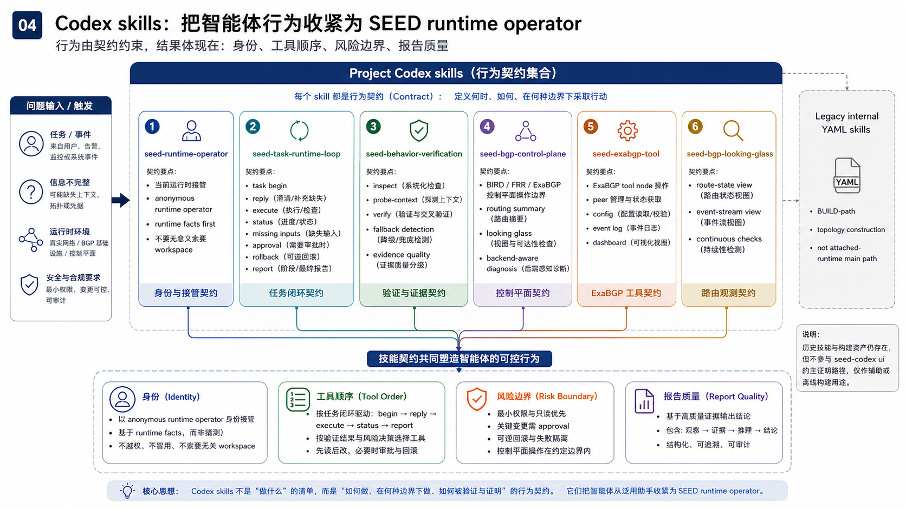

项目 Codex skills 把通用 Codex 收紧为 SEED runtime operator：

| Skill | 行为约束 |
|---|---|
| `seed-runtime-operator` | 以当前 runtime 为主，避免无意义索要 workspace，从运行态证据开始 |
| `seed-task-runtime-loop` | 使用 begin/reply/execute/status 执行结构化任务，处理输入、确认、回滚、报告 |
| `seed-behavior-verification` | 演示前检查 active stack、probe-context、verify、fallback、证据质量 |
| `seed-bgp-control-plane` | BIRD/FRR/ExaBGP 场景优先 routing evidence，按 backend 理解行为 |
| `seed-exabgp-tool` | 识别 ExaBGP 工具节点、peer、config、event log、dashboard |
| `seed-bgp-looking-glass` | 区分 route-state view 与 event-stream view，支持持续健康检查 |

旧的 YAML skill 系统属于 BUILD-path 拓扑构建模板，用于旧 agent graph；当前 attached-runtime 主线依赖 Codex skills、SeedAgent MCP 和 SeedOps MCP。

**展示重点**：skills 的价值不在文件数量，而在行为收敛。`seed-runtime-operator` 解决自我定位，避免反复向用户索要 workspace；`seed-bgp-control-plane` 和 `seed-exabgp-tool` 让 BGP/ExaBGP 场景不再被当成普通 Linux 排障；`seed-behavior-verification` 让演示前可以检查 fallback、证据质量和越界风险。它们共同把通用智能体压到“运行态网络操作者”的轨道上。

## Mission 任务闭环

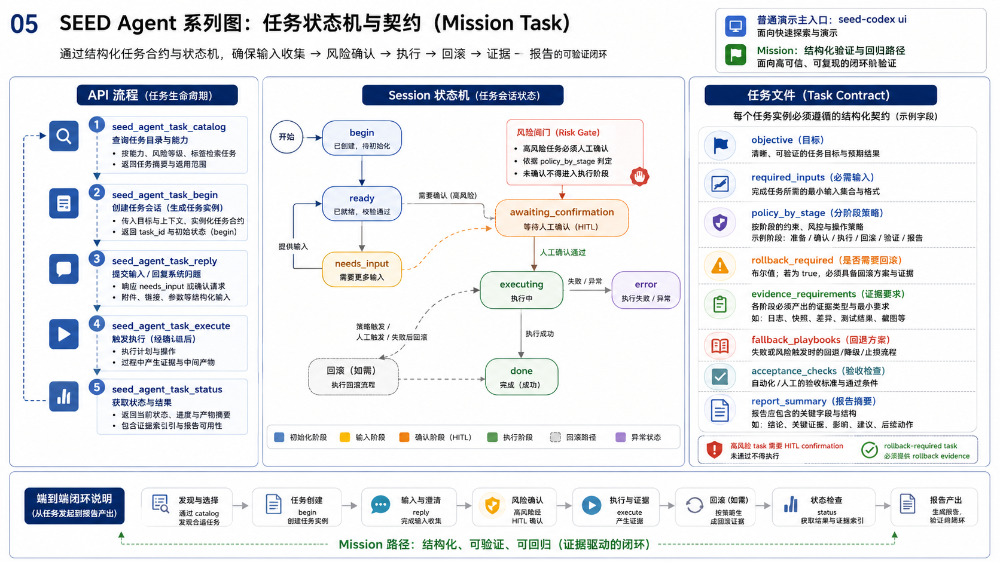

Mission 用于结构化验证、回归和可复现实验流程。核心 API：

```text
seed_agent_task_catalog
seed_agent_task_begin
seed_agent_task_reply
seed_agent_task_execute
seed_agent_task_status
```

任务状态覆盖 `ready`、`needs_input`、`awaiting_confirmation`、`executing`、`done`、`error`。任务文件定义 objective、required inputs、policy_by_stage、fallback playbook、rollback_required、evidence_requirements、acceptance_checks 和 report template。

演示中主入口仍采用 `seed-codex ui`；mission 适合展示任务契约、风险确认、回放和报告。

**展示重点**：mission 的价值在于把高价值任务沉淀成可复用流程。读者可以把它理解为“实验任务规格”：目标、输入、权限、fallback、证据、验收都写清楚。现场如果老师关心可复现性，就展示 mission；如果老师关心智能体现场分析能力，就用 `ui` 对话。

## 证据报告结构

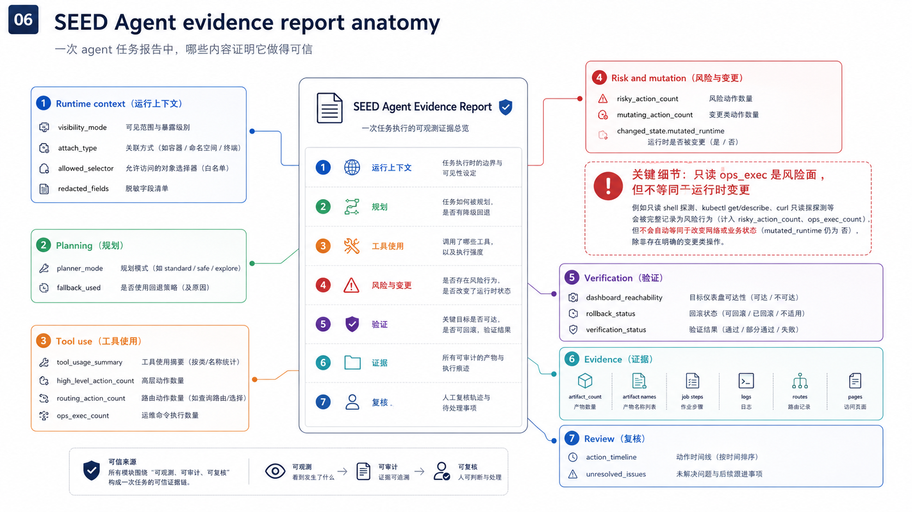

任务成功不能只看最终回答。报告需要回答四个问题：

| 问题 | 关键字段 |
|---|---|
| 面对的 runtime 是什么 | `visibility_mode`、`attach_type`、`allowed_selector`、`redacted_fields` |
| 如何规划和执行 | `planner_mode`、`fallback_used`、`action_timeline` |
| 用了哪些工具 | `tool_usage_summary`、`high_level_action_count`、`routing_action_count`、`ops_exec_count` |
| 是否越界或改变网络 | `risky_action_count`、`mutating_action_count`、`changed_state.mutated_runtime` |
| 如何验证结果 | `dashboard_reachability`、`rollback_status`、`verification_status`、`artifact_count` |

`ops_exec` 在审计中保留为高风险工具面；只读命令不自动计入 runtime mutation。这个区分对演示很关键：可以承认使用了 shell 采证，同时证明没有修改网络。

**展示重点**：这张图回答“结果是不是你手动做的、智能体有没有乱动网络”。报告里既记录工具选择，也记录动作是否真的改变 runtime。比如 B30 只读发现任务中，`ops_exec_count=1` 说明用过 shell 采集证据，`mutated_runtime=false` 说明没有改配置、没有改路由、没有重启服务。这个粒度比一句“任务成功”更可信。

## BGP 控制面 Core 能力

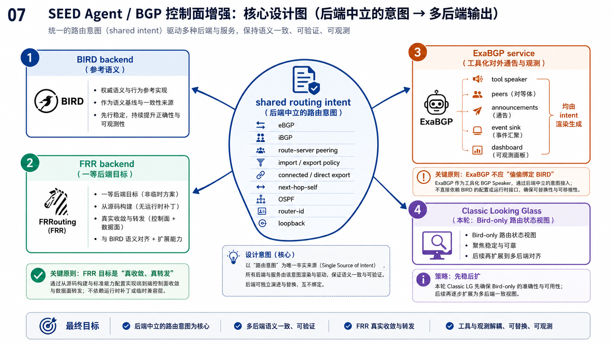

BGP 控制面增强围绕共享语义展开：

| 能力 | 目标 |
|---|---|
| BIRD backend | 保留参考语义和已有稳定路径 |
| FRR backend | 形成一等 routing backend，支持真实源码构建、收敛和互操作验证 |
| backend-neutral intent | 统一表达 eBGP、iBGP、route server、import/export、next-hop、OSPF、router-id |
| ExaBGP service | 作为工具 speaker 声明 peer、announcement、event sink、dashboard |
| Classic Looking Glass | 本轮先稳定 Bird route-state view |
| Event Dashboard | 与 ExaBGP 配合展示 BGP 事件流 |

控制面扩展的价值在于把 FRR、ExaBGP、Looking Glass 变成可复用基础能力。A12/A13/A14/B30 是验证样例，核心目标是后续更多实验可以复用同一套控制面能力。

## 控制面验证矩阵

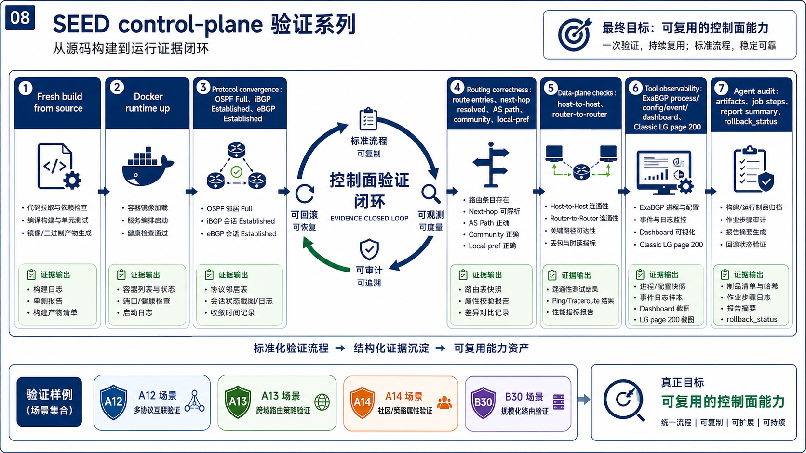

控制面验收覆盖多层证据：

| 验证层 | 检查项 |
|---|---|
| 构建 | fresh build from source、Docker output 生成、无手改 output |
| 协议 | OSPF Full、iBGP Established、eBGP Established |
| 路由 | route entries、next-hop resolved、AS path、community、local-pref |
| 连通 | host-to-host、router-to-router |
| 工具 | ExaBGP process/config/event/dashboard、Classic LG page 200 |
| Agent | artifacts、job steps、report summary、rollback_status |

这个矩阵用于防止“容器启动即成功”的误判。FRR 需要证明控制面和转发面行为正确；ExaBGP 需要证明 peer、announcement、event surface 和 dashboard；Looking Glass 需要证明页面、进程、socket 和 route-state 来源。

**展示重点**：控制面例子必须从“能启动”走到“能验证”。FRR 的验收要覆盖协议收敛、路由传播、next-hop、连通性和策略；ExaBGP 的验收要覆盖配置、进程、peer、公告、事件和 dashboard；Looking Glass 的验收要覆盖页面入口、后端进程和路由来源。这样后续新增 BGP 实验时，可以沿用同一套质量标准。

## 示例总览

| 展示包 | 来源实验 | 规模 | 亮点 | 推荐状态 |
|---|---|---:|---|---|
| `Z00` | `B00_mini_internet` | 约 61 services | mini Internet 运行态理解、路径与 BGP 诊断 | `Go` |
| `Z01` | `Y01_bgp_prefix_hijacking` | 约 125 services | prefix hijack 安全演练、before/during/after 证据 | `Conditional Go` |
| `Z02` | `A02_transit_as_mpls` | 约 13 services | MPLS/FRR 控制面检查、label path、traceroute | `Conditional Go` |
| `Z12` | `A12_bgp_mixed_backend` | 约 11 services | BIRD/FRR 混合后端、迁移验证、route injection 回滚 | `Conditional Go` |
| `Z13` | `A13_exabgp_control_plane` | 约 7 services | ExaBGP 工具节点、peer、事件日志、dashboard | `Conditional Go` |
| `Z30` | `B30_mini_internet_exabgp_ix` | 38 services / 35 nodes / 24 ASNs | IX 直连 ExaBGP 工具路由器、多 peer、route evidence | `Conditional Go` |
| `Z14` | `A14_bgp_event_looking_glass` | 约 8 services | route-state LG 与 event dashboard 对照 | `Conditional Go` |
| `Z28` | `B28_traffic_generator` | 约 63 services | 运行态识别 generator/receiver、实验设计 | `Go` |
| `Z29` | `B29_email_dns` | 约 85 services | DNS/MX/邮件投递、Roundcube、故障恢复 | `Go` |

## Z00 / B00 Mini Internet

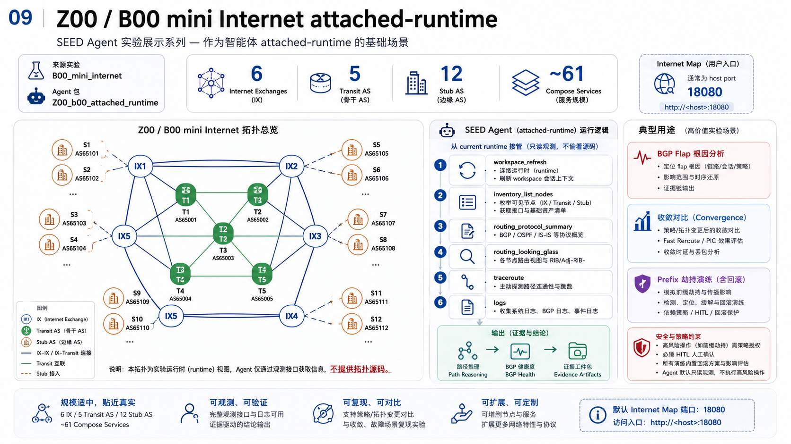

| 项 | 内容 |
|---|---|
| 来源 | `examples/internet/B00_mini_internet/output` |
| Agent 包 | `examples/agent-specific/Z00_b00_attached_runtime` |
| 规模 | 6 个 Internet Exchange，5 个 transit AS，12 个 stub AS，约 61 services |
| 可视化 | Internet Map，常用 `http://127.0.0.1:18080/map.html` |
| 证据面 | routing summary、looking glass、traceroute、logs、artifacts |

适合展示智能体如何从运行态理解一个 mini Internet：识别 IX、transit AS、stub AS，解释路径和 BGP 证据。高风险 prefix drill 需要策略门、确认和 rollback。

**设计位置**：B00 是智能体运行态理解的基准盘。它足够复杂，有 IX、transit AS、stub AS 和 BGP 路径；又足够稳定，适合先让 agent 证明“我能从当前 runtime 理解网络”。展示时不要急着让它改路由，先让它解释网络结构、路径证据和观测入口。这个例子承担的是基础能力校准：agent 能否在不偷看构建期拓扑的情况下，建立对网络的运行态认知。

推荐提示：

```text
接管当前 mini internet。先只读观察，不看构建期拓扑文件。根据运行态证据总结 IX、transit AS、stub AS、关键路径和 BGP 健康状态。
```

## Z01 / Y01 Prefix Hijack Drill

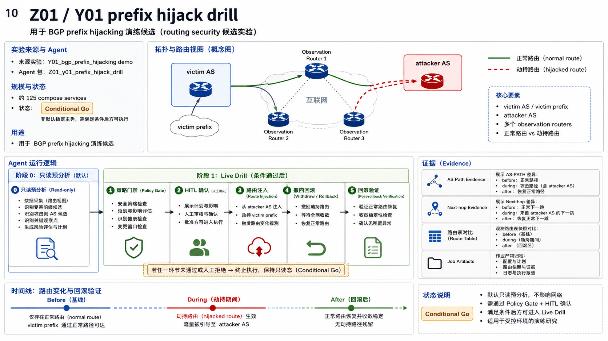

| 项 | 内容 |
|---|---|
| 来源 | `examples/yesterday_once_more/Y01_bgp_prefix_hijacking/demo/output` |
| Agent 包 | `examples/agent-specific/Z01_y01_prefix_hijack_drill` |
| 规模 | 约 125 services |
| 类型 | BGP prefix hijacking security drill candidate |
| 证据面 | victim prefix、attacker AS、AS path、next-hop、before/during/after、rollback |

适合展示路由安全演练的分析阶段。先只读识别受害前缀、攻击侧 AS 和观察点；进入 live drill 前必须明确范围、风险、回滚和复验口径。

**设计位置**：Y01 用来展示智能体面对 routing security 场景时的“风险意识”。它不适合作为第一主秀，因为规模更大、启动更重，但它非常适合说明高风险任务为什么需要 before/during/after 证据。好的演示会先让 agent 设计观察点、判断影响范围、说明回滚和复验路径，再决定是否进入受控动作。

推荐提示：

```text
接管当前 prefix hijack 实验。先只读分析可能的受害前缀、攻击侧 AS、关键观察点，并设计 before/during/after 验证口径。不要执行劫持。
```

## Z02 / A02 MPLS Control Plane

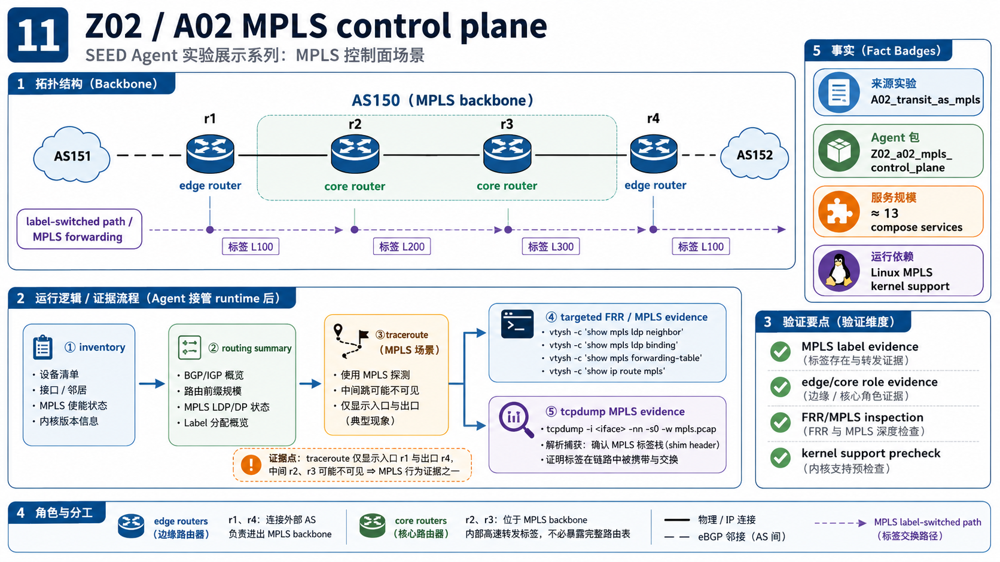

| 项 | 内容 |
|---|---|
| 来源 | `examples/basic/A02_transit_as_mpls/output` |
| Agent 包 | `examples/agent-specific/Z02_a02_mpls_control_plane` |
| 规模 | 约 13 services |
| 核心拓扑 | `AS150` MPLS backbone，edge routers `r1/r4`，core routers `r2/r3` |
| 客户侧 | `AS151`、`AS152` |
| 前置条件 | Linux MPLS kernel support |

MPLS 场景的重点是 label-switched path、edge/core 角色与控制面证据。中间 hop 在 traceroute 中不可见时，需要结合 MPLS label evidence 判断。

**设计位置**：A02 把展示从普通 IP/BGP 拓展到更底层的转发机制。它考验 agent 能不能把“看不见中间 hop”解释为 MPLS 行为，而不是误判为网络坏了。现场讲解时可以强调 edge router 和 core router 的职责差异：边缘节点承载 BGP 语义，核心节点主要承担 LDP/OSPF/MPLS 转发。这个例子也提醒观众，运行态智能体需要理解协议现象，不能只按 ping 成败下结论。

推荐提示：

```text
接管当前 MPLS 实验。说明 AS150 中哪些是 edge router、哪些是 core router；用运行态证据解释 MPLS label path、traceroute 现象和需要补充的 FRR/MPLS 证据。
```

## Z12 / A12 BIRD-FRR Mixed Backend

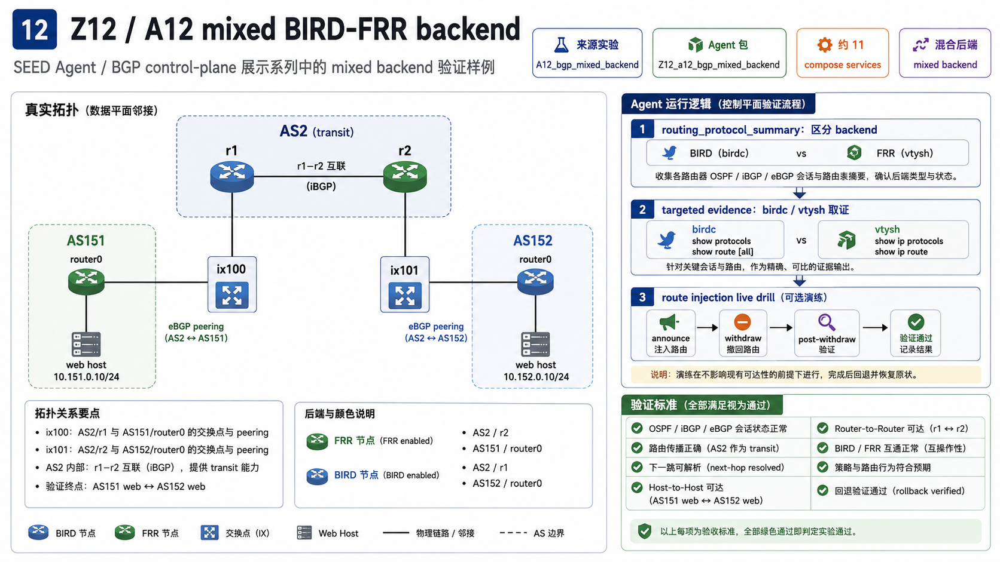

| 项 | 内容 |
|---|---|
| 来源 | `examples/basic/A12_bgp_mixed_backend/output` |
| Agent 包 | `examples/agent-specific/Z12_a12_bgp_mixed_backend` |
| 规模 | 约 11 services |
| IX | `ix100`、`ix101` |
| Transit | `AS2/r1`、`AS2/r2` |
| Customer | `AS151/router0 + web`、`AS152/router0 + web` |
| FRR 节点 | `AS2/r2`、`AS151/router0` |
| BIRD 节点 | `AS2/r1`、`AS152/router0` |

A12 展示 BIRD/FRR 混合后端和 FRR 迁移验证。成功标准包括邻居建立、路由传播、next-hop 解析、主机连通、router-to-router、route injection 和 withdraw rollback。

**设计位置**：A12 是 FRR core 能力的验收样例，不是为了展示“某个容器里装了 FRR”。我们一路把关注点从运行时修补推进到源码构建和 backend 语义对齐，A12 就承担混合后端互操作验证：同一个 AS/IX 拓扑中，BIRD 和 FRR 必须同时参与收敛和转发。现场重点看 FRR 节点、BIRD 节点、互通证据和 rollback 证据，避免只展示 `vtysh` 命令。

推荐提示：

```text
接管当前 A12。先只读识别哪些 BGP speaker 是 BIRD，哪些是 FRR；给出互操作证据、路由证据、next-hop 证据，并说明最安全的下一步 FRR 迁移验证。
```

## Z13 / A13 ExaBGP Control-Plane Tool

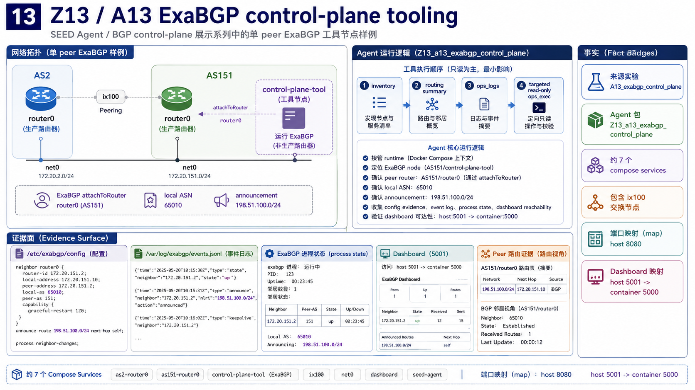

| 项 | 内容 |
|---|---|
| 来源 | `examples/basic/A13_exabgp_control_plane/output` |
| Agent 包 | `examples/agent-specific/Z13_a13_exabgp_control_plane` |
| 规模 | 约 7 services |
| IX | `ix100` |
| Router | `AS2/router0`、`AS151/router0` |
| Tool node | `AS151/control-plane-tool` |
| ExaBGP | local ASN `65010`，announcement `198.51.100.0/24` |
| 端口 | dashboard host `5001` -> container `5000`，map host `8080` |

ExaBGP 在 A13 中是控制面工具节点，用于观察和产生 BGP 事件。证据包括 ExaBGP 配置、peer state、announcement、event log、dashboard。

**设计位置**：A13 回答“ExaBGP 能不能作为 SEED 里的 BGP 工具节点”。它的价值在于把一个外部常用的 BGP Swiss Army Knife 放进仿真器，使后续实验可以用它产生公告、记录事件、暴露 dashboard。展示时要把 ExaBGP 讲成工具节点，而不是普通 Web 服务；看点是它和 router 的 peer 关系、公告配置、事件日志和页面可达性。

推荐提示：

```text
接管当前 A13。找到 ExaBGP 工具节点，说明它与哪个 router 对等，local ASN 和公告前缀是什么，并给出 config、event log、dashboard 和 peer route 证据。
```

## Z30 / B30 Mini Internet ExaBGP IX Tool

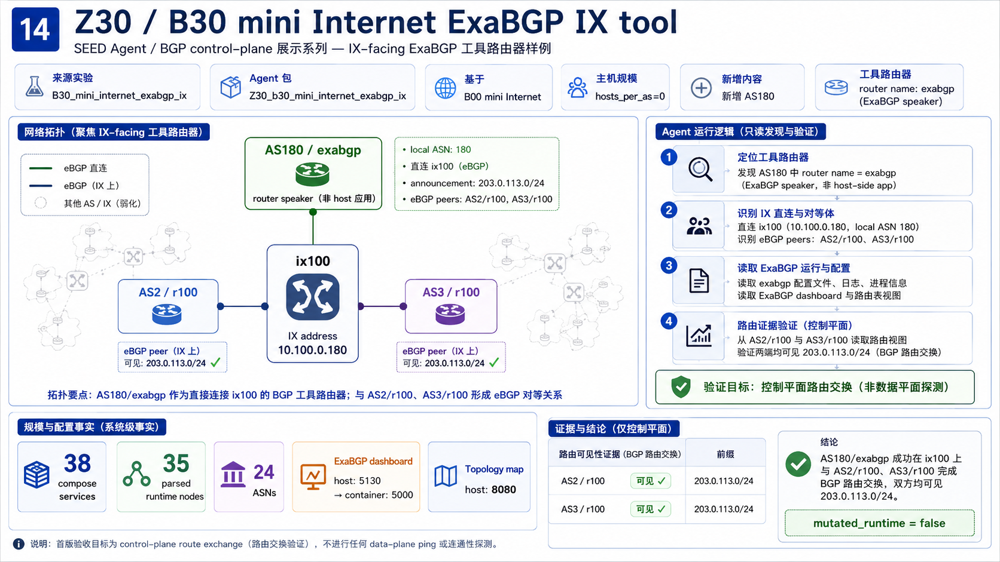

| 项 | 内容 |
|---|---|
| 来源 | `examples/internet/B30_mini_internet_exabgp_ix/output` |
| Agent 包 | `examples/agent-specific/Z30_b30_mini_internet_exabgp_ix` |
| 基础 | B00 mini Internet，`hosts_per_as=0` |
| 规模 | 38 services，35 parsed runtime nodes，24 ASNs |
| 新增 AS | `AS180` |
| Tool router | `AS180/exabgp` |
| IX | `ix100` |
| IX 地址 | `10.100.0.180` |
| BGP | local ASN `180`，announcement `203.0.113.0/24` |
| Peers | `AS2/r100`、`AS3/r100` |
| 端口 | dashboard host `5130` -> container `5000`，map host `8080` |

B30 把 ExaBGP 做成 IX 直连 BGP tool router。它不是普通 host-side app；它以 AS180 router speaker 身份在 ix100 上与 AS2/r100、AS3/r100 建立 eBGP peer。

**设计位置**：B30 是 A13 的扩展版，也是当前 ExaBGP 控制面能力最完整的展示。A13 证明单 peer 工具节点可行，B30 把它放进 mini Internet 的 IX 场景：AS180 作为真正的 BGP speaker 在 ix100 上和 AS2、AS3 对等。这个例子特别适合展示“构建能力 + 运行态验证 + agent 只读发现”的组合：先看规模，再看 AS180、peer、公告前缀，最后看 AS2/AS3 路由证据和 dashboard。

已验证结果：

| 检查项 | 结果 |
|---|---|
| ExaBGP dashboard | `http://127.0.0.1:5130/` 返回 `200` |
| Internet Map | `http://127.0.0.1:8080/pro/home` 返回 `200` |
| AS2 route evidence | `AS2/r100` 看到 `203.0.113.0/24` |
| AS3 route evidence | `AS3/r100` 看到 `203.0.113.0/24` |
| Agent 审计 | 只读发现任务完成，`mutated_runtime=false` |

推荐提示：

```text
接管当前 B30。不要修改配置，找到 AS180 ExaBGP IX 工具 router，说明它和 AS2/r100、AS3/r100 的 BGP 对等关系，并给出 route、event、dashboard、process、config 和日志证据。
```

## Z14 / A14 BGP Event Looking Glass

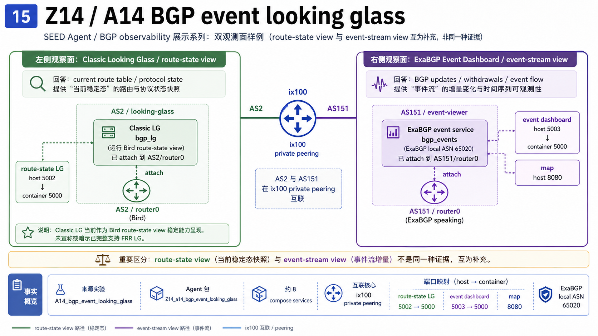

| 项 | 内容 |
|---|---|
| 来源 | `examples/basic/A14_bgp_event_looking_glass/output` |
| Agent 包 | `examples/agent-specific/Z14_a14_bgp_event_looking_glass` |
| 规模 | 约 8 services |
| IX | `ix100` |
| Route-state side | `AS2/looking-glass` attach `AS2/router0` |
| Event side | `AS151/event-viewer` attach `AS151/router0` |
| ExaBGP | local ASN `65020` |
| 端口 | LG host `5002` -> container `5000`，event dashboard host `5003` -> container `5000`，map host `8080` |

A14 体现两个观察面：Classic Looking Glass 提供 route-state view，ExaBGP event dashboard 提供 event-stream view。两类证据回答不同问题：当前状态与变化过程。

**设计位置**：A14 用来讲清楚 BGP 可视化的两种视角。Classic Looking Glass 看到的是某个时刻的路由状态，ExaBGP event dashboard 看到的是控制面事件流。很多演示会把“当前路由表”和“事件变化”混在一起，A14 正好把两者拆开。现场可以让 agent 分别解释两个页面能回答什么问题，再说明为什么二者互补。

推荐提示：

```text
接管当前 A14。找到 route-state looking glass 和 ExaBGP event dashboard，说明两者分别回答什么问题，并给出页面、进程、日志和路由状态证据。
```

## Z28 / B28 Traffic Generator

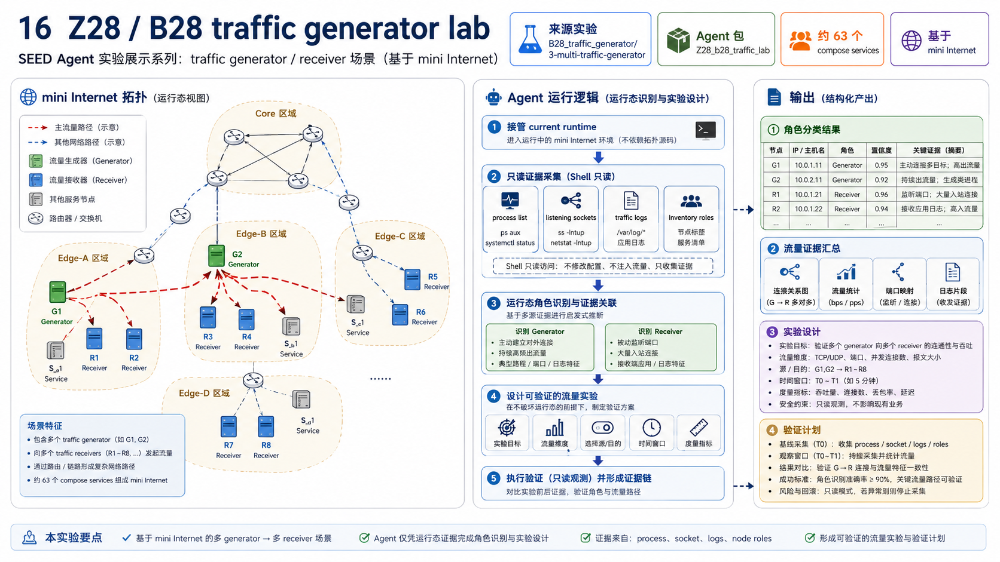

| 项 | 内容 |
|---|---|
| 来源 | `examples/internet/B28_traffic_generator/3-multi-traffic-generator/output` |
| Agent 包 | `examples/agent-specific/Z28_b28_traffic_lab` |
| 规模 | 约 63 services |
| 角色 | traffic generator、traffic receivers |
| 证据面 | process、socket、logs、node roles |

B28 展示非 BGP 的运行态角色识别。智能体需要从进程、socket、日志和 inventory 判断谁在发流量、谁在接收、实验边界如何设置。

**设计位置**：B28 用来证明 agent 能力不局限在 BGP。它的重点是运行态角色发现：在一个已经起来的网络中，谁是 generator、谁是 receiver、流量如何产生、证据来自哪里。展示时不要只让 agent 列命令，而是让它解释判断依据。这个例子也适合作为未来自动实验设计的入口：先识别角色，再提出可验证实验。

推荐提示：

```text
接管当前 B28。不要看拓扑源码，只根据进程、socket、日志和节点角色识别 traffic generator 与 receivers，并设计一个可验证的流量实验。
```

## Z29 / B29 Mail DNS Runtime Ops

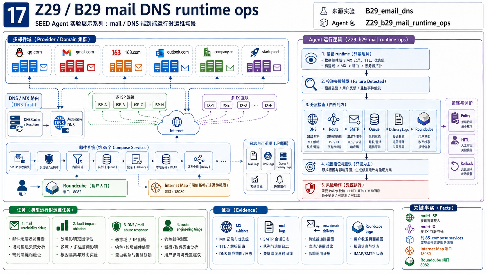

| 项 | 内容 |
|---|---|
| 来源 | `examples/internet/B29_email_dns/output` |
| Agent 包 | `examples/agent-specific/Z29_b29_mail_runtime_ops` |
| 规模 | 约 85 services |
| 网络 | multi-ISP、multi-IX、DNS-first email system |
| 邮件域 | `qq.com`、`gmail.com`、`163.com`、`outlook.com`、`company.cn`、`startup.net` |
| 端口 | Internet Map `18080`，Roundcube `8082` |
| 证据面 | DNS MX、SMTP delivery、mail logs、Roundcube、routing state |

B29 是端到端服务运维主秀。它覆盖 DNS/MX、SMTP、IMAP/Roundcube、跨域邮件投递、邮件日志、服务可达性和故障恢复。

**设计位置**：B29 是最容易让非 BGP 背景观众理解的主秀。邮件系统天然跨 DNS、路由、SMTP、存储、前端页面和日志，能完整展示智能体如何分层排障。演示时先从 Roundcube 和 MX 讲起，再进入 mail logs 和跨域投递证据；如果要展示恢复能力，再引入受控故障和 rollback。它承担的是“智能体真的能做运维”的直观证明。

推荐提示：

```text
接管当前 B29。先只读理解邮件系统：有哪些邮件域，DNS/MX 如何工作，Roundcube 在哪里，跨域投递应该从哪些日志验证。不要修改服务。
```

进阶提示：

```text
现在假设某两个域之间邮件收不到。请分层检查 DNS、路由、SMTP、queue、投递日志和 Roundcube，只在确认范围后提出最小修复动作。
```

## Kubernetes Scale-Out 方向

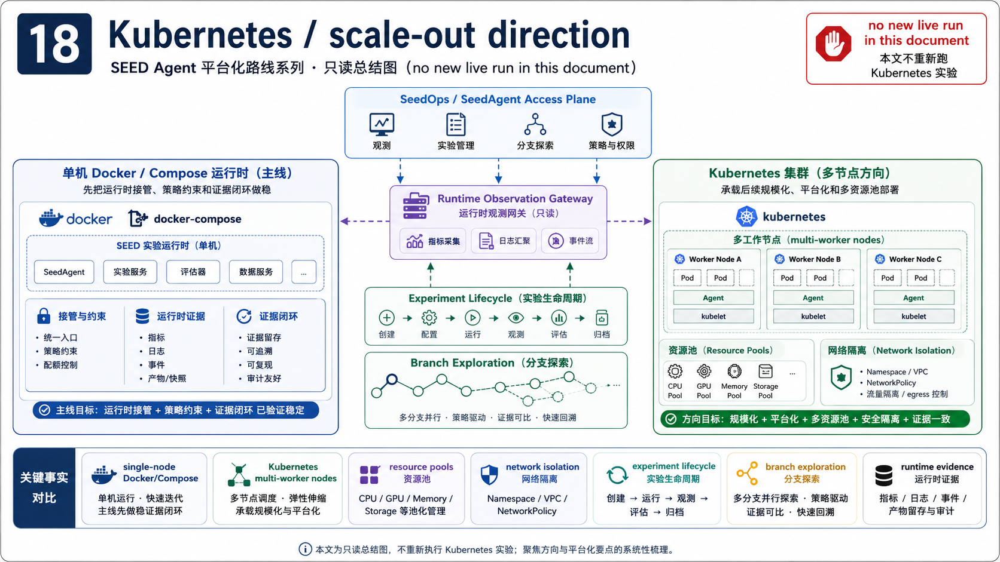

Kubernetes 方向服务平台化和规模化：

| 方向 | 内容 |
|---|---|
| 部署形态 | 从单机 Docker/Compose 扩展到 multi-worker nodes |
| 资源管理 | resource pools、network isolation、实验生命周期 |
| 观测入口 | runtime observation gateway |
| 智能体接入 | SeedOps / SeedAgent access plane |
| 当前口径 | 分支探索和只读总结，不重新跑新实验 |

Docker/Compose 主线已经打通运行时接管、策略约束、证据闭环。Kubernetes 后续承载多节点部署、多资源池和更接近平台化的实验运行方式。

**设计位置**：Kubernetes 分支代表规模化部署方向。单机 Docker/Compose 适合先把 agent 的接管、工具、策略和证据闭环做稳；Kubernetes 面向后续更大的实验平台，重点变成实验生命周期、多 worker node、资源池、网络隔离、镜像分发和统一观测入口。这个方向可以和智能体自然结合：agent 不需要关心底层在哪台机器，只需要通过 SeedOps/SeedAgent access plane 看到一致的 runtime evidence。

展示时可以强调三点：第一，Kubernetes 让实验从本机演示走向平台化运行；第二，多节点环境会放大端口、网络、资源和证据归档问题；第三，当前 agent harness 的分层设计已经为这个方向预留接口，后续可以把 Docker runtime 换成集群 runtime，而不改变上层任务和审计模型。

## 现场启动与使用

每次只启动一个实验 runtime：

```bash
cd <example-output-dir>
dcup
```

或使用 compose：

```bash
docker compose up -d
```

进入智能体：

```bash
scripts/seed-codex status
scripts/seed-codex inspect
scripts/seed-codex ui -m gpt-5.4 -c 'model_reasoning_effort="low"'
```

开场提示：

```text
接管当前唯一在线的 SEED 网络。先不要修改配置，只通过运行态证据说明这个网络里有哪些关键节点、服务、路由状态和可视化入口。
```

浏览器访问优先使用 `127.0.0.1:<port>`。命令行检查页面时绕过本机代理：

```bash
curl --noproxy '*' http://127.0.0.1:<port>/
```

## 推荐展示顺序

服务运维主线：

1. `Z29/B29`：邮件/DNS/Roundcube，最容易给非协议背景观众建立直觉。
2. `Z00/B00`：mini Internet 运行态理解，展示路径和 BGP 诊断。
3. `Z28/B28`：运行态识别 generator/receiver，展示非 BGP 泛化能力。

BGP 控制面主线：

1. `Z12/A12`：BIRD/FRR 混合后端与 FRR 迁移验证。
2. `Z13/A13`：ExaBGP 单 peer 控制面工具节点。
3. `Z30/B30`：mini Internet 中 IX 直连 ExaBGP 多 peer 工具 router。
4. `Z14/A14`：route-state view 与 event-stream view 对照。

智能体工程主线：

1. seed-codex 激活链：专用 CODEX_HOME、config、skills、MCP。
2. Agent/MCP/runtime 分层：高层任务、策略门、运行时工具面。
3. Mission 状态机：任务契约、确认门、fallback、报告。
4. 审计报告：工具使用、风险、mutation、证据、verification。

## 最小验收清单

| 阶段 | 检查 |
|---|---|
| Runtime | `docker ps` 能看到目标实验容器；只保留一个主要 baseline 在线 |
| Harness | `scripts/seed-codex status` 正常；`inspect` 能看到 CODEX_HOME、skills、MCP |
| Agent | 不无意义追问 workspace；先做只读运行态观察 |
| Tools | 优先 `workspace_refresh`、`inventory_list_nodes`、`routing_*`、`ops_logs` |
| Evidence | 总结中明确 route/log/page/artifact 来源 |
| Risk | 高风险动作有 policy/HITL/rollback；只读 `ops_exec` 不算 runtime mutation |
