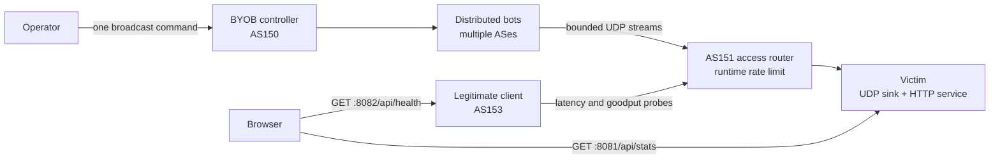

# Botnet Denial-of-Service Attack

Y13 demonstrates how an established botnet can coordinate a denial-of-service
attack inside the isolated SEED Emulator Internet. Unlike Y03, which focuses on
the Mirai infection story, Y13 starts with enrolled bots and focuses on
command-and-control, aggregate traffic, and the impact on legitimate users.

The example reuses the emulator's BYOB services from
`seedemu/services/BotnetService.py`. The attack program is intentionally
example-owned and preinstalled on every bot. BYOB is used to invoke that program
across all enrolled clients with one broadcast command.

## Topology

- AS150: BYOB controller at `10.150.0.66`.
- AS151: victim at `10.151.0.71` and its access router.
- AS153: legitimate client running the health and bandwidth probe.
- AS152, AS154, and selected AS160--AS171 networks: distributed bot clients.
- Victim UDP port `9000`: reply-free attack sink.
- Victim TCP port `8000`: synthetic legitimate HTTP service.



## Safety and repeatability

`bot_attack.py` is constrained to the Y13 victim, `10.151.0.71:9000`. It does
not accept a destination argument or spoof source addresses. It also enforces
upper bounds on duration, packet rate, payload size, rounds, and the delay
between rounds. The default command stops after ten seconds.

The configured load shown by the dashboard is an estimate based on the default
command. It includes the 20-byte IPv4 header and 8-byte UDP header. The observed
rate comes from IPv4 Total Length values reported by `tcpdump` on the victim.

## Build and start

From the repository root, run the following program (the default 
bot-count is eight bots). 

```sh
python emulator.py --bot-count 12
```


Bots are assigned round-robin across the candidate ASes. Counts greater than
the number of candidate ASes create multiple bot hosts in some ASes. Y13 checks
the standard automatic host allocation range and rejects a count that would
overflow it; the maximum therefore depends on `--hosts-per-as`.

## Open the dashboard

Open <http://localhost:8081>. The browser gets attack traffic statistics from
the victim on host port `8081` and health data directly from the legitimate
client's probe on host port `8082`.

At baseline, the attack counter should be idle and the legitimate HTTP service
should be healthy.

## Make network contention visible

The rate limit is controlled at runtime and is not hardcoded into the topology.
Apply it to the AS151 border-router interface facing the victim network:

```sh
docker exec brdnode_151_router0 \
  python3 /opt/botnet-dos/traffic_visualizer/network_control.py set \
  --subnet 10.151.0.0/24 --rate 8mbit
```

Inspect or remove it with:

```sh
docker exec brdnode_151_router0 \
  python3 /opt/botnet-dos/traffic_visualizer/network_control.py status \
  --subnet 10.151.0.0/24

docker exec brdnode_151_router0 \
  python3 /opt/botnet-dos/traffic_visualizer/network_control.py clear \
  --subnet 10.151.0.0/24
```

The router name starts with `brdnode`, which is the naming convention generated
for these router containers.

## Launch through BYOB

Enter the controller and display the prepared instructions:

```sh
docker compose -f output/docker-compose.yml exec -it hnode_150_bot-controller bash
show-attack-command
start-byob-shell
```

Inside the BYOB shell, first confirm that clients are enrolled:

```text
sessions
```

Then invoke the pre-installed sender on every client:

```text
broadcast python3 /opt/botnet-dos/bot_attack.py --duration 10 --pps 200 --packet-size 1200
```

With eight bots, this command offers approximately 15.72 Mbps at the IP layer.
While it runs, the dashboard bot icons animate, the attack rate rises, and the
health panel should show increased latency, reduced goodput, failures, or a
combination of these effects.

Multiple bounded rounds can also illustrate degradation and recovery:

```text
broadcast python3 /opt/botnet-dos/bot_attack.py --duration 8 --pps 200 --packet-size 1200 --rounds 3 --interval 5
```

## Important interpretation

The animated icons represent the configured bot population and become active
when the victim observes attack traffic. The current Traffic Visualizer counts
aggregate traffic; it does not yet claim that every configured bot is actively
sending. Optional source-IP aggregation can be added to the shared tool later
if the lesson needs a measured active-source count.

## Automated validation

`example.yaml` follows the standard example lifecycle. Its runtime test checks
BYOB infrastructure, bot installation, the victim services, the health API, and
the router control tool. It sends only a sub-second, approximately one-packet
smoke stream from one bot; automated testing never launches the DoS workload.
