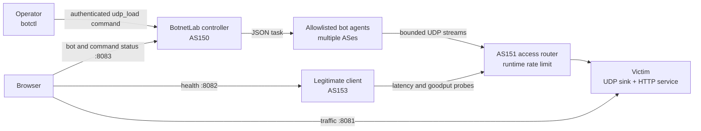

# Botnet Denial-of-Service Attack

Y13 demonstrates how a centrally controlled botnet can coordinate a
denial-of-service attack inside the isolated SEED Emulator Internet. Unlike Y03,
which focuses on the Mirai infection story, Y13 begins with enrolled bots and
focuses on command fan-out, aggregate traffic, and impact on legitimate users.

The example uses the dependency-free framework in `tools/BotnetLab`. Each bot
runs the shared allowlisted agent and registers the example-owned `udp_load`
handler. The controller cannot send arbitrary shell commands or choose a new
executable at runtime.

## Topology

- AS150: BotnetLab controller at `10.150.0.66`.
- AS151: victim at `10.151.0.71` and its access router.
- AS153: legitimate client running the health and bandwidth probe.
- AS152, AS154, and selected AS160--AS171 networks: distributed bot clients.
- Victim UDP port `9000`: reply-free attack sink.
- Victim TCP port `8000`: synthetic legitimate HTTP service.



## Safety and repeatability

`bot_attack.py` is constrained to the Y13 victim, `10.151.0.71:9000`. It does
not accept a destination or spoof source addresses. It enforces upper bounds on
duration, packet rate, payload size, rounds, and the interval between rounds.

BotnetLab adds a second boundary: the bot agent is configured at startup with
only this mapping:

```text
udp_load=/opt/botnet-dos/bot_attack.py
```

Commands contain JSON parameters, not shell text. A task is dispatched only to
bots that registered the requested capability. The default command stops after
ten seconds.

## Build and start

From the repository root:

```sh
# The default value for bot-count is 8
python emulator.py --bot-count 12

# Start the emulator.
docker compose -f output/docker-compose.yml up
```


Bots are assigned round-robin across the candidate ASes. Their addresses are
assigned explicitly: Y13 first uses addresses after B00's automatically created
hosts, then wraps to `.2` through `.70`. Address `.1` is never used, and `.254`
remains available to the router. The allocator also skips B00's explicit
`10.154.0.129` address.

## Open the dashboard

Open <http://localhost:8081>. The browser fetches three independent data
sources:

```text
http://localhost:8081/api/stats       victim attack traffic
http://localhost:8082/api/health      legitimate-client health
http://localhost:8083/api/bots        measured bot enrollment and state
http://localhost:8083/api/commands    command progress
```

Each icon represents an actual BotnetLab registration. Online bots are visible, running bots animate,
and unavailable bots remain dimmed.


## Make network contention visible

The rate limit is controlled at runtime and is not hardcoded into the topology.
Apply it to the AS151 border-router interface facing the victim network:

```sh
docker exec brdnode_151_router0 \
  python3 /opt/botnet-dos/traffic_visualizer/network_control.py set \
  --subnet 10.151.0.0/24 --rate 8mbit
```

Inspect or remove it with:

```sh
docker exec brdnode_151_router0 \
  python3 /opt/botnet-dos/traffic_visualizer/network_control.py status \
  --subnet 10.151.0.0/24

docker exec brdnode_151_router0 \
  python3 /opt/botnet-dos/traffic_visualizer/network_control.py clear \
  --subnet 10.151.0.0/24
```

The router name starts with `brdnode`, which is the naming convention generated
for these router containers.

## Inspect the botnet

The controller container includes a wrapper named `botctl` with the Y13
controller URL and token already configured:

```sh
docker compose -f output/docker-compose.yml exec hnode_150_bot-controller botctl bots
docker compose -f output/docker-compose.yml exec hnode_150_bot-controller botctl commands
```

The bot list shows measured online state, current agent state, ASN, and the
registered `udp_load` capability.

## Launch the attack

The default workload is 200 packets per second per bot with a 1200-byte UDP
payload for ten seconds:

```sh
docker compose -f output/docker-compose.yml exec hnode_150_bot-controller \
  botctl launch udp_load \
  --parameters '{"duration_seconds":10,"packets_per_second":200,"udp_payload_bytes":1200}'
```

`botctl` prints a command ID. Use it to watch delivery and execution:

```sh
docker compose -f output/docker-compose.yml exec hnode_150_bot-controller \
   botctl command COMMAND_ID --watch
```

With eight bots, the default command offers approximately 15.72 Mbps at the IP
layer. The estimate includes the 20-byte IPv4 header and 8-byte UDP header. The
dashboard's observed rate comes from IPv4 Total Length values reported by
`tcpdump` on the victim.

Multiple bounded rounds can illustrate degradation and recovery:

```sh
docker compose -f output/docker-compose.yml exec hnode_150_bot-controller \
  botctl launch udp_load --timeout 60 \
  --parameters '{"duration_seconds":8,"packets_per_second":200,"udp_payload_bytes":1200,"rounds":3,"round_interval_seconds":5}'
```

The command timeout must cover all rounds and intervals. Every handler still
enforces its own maximum duration and round count.

## Cancel a scheduled command

Commands start two seconds after creation by default so bots can begin at
approximately the same time. During that window, undelivered or delivered
assignments can be cancelled:

```sh
docker compose -f output/docker-compose.yml exec hnode_150_bot-controller botctl cancel COMMAND_ID
```

Cancellation does not terminate a handler that is already running. Y13's
handler is therefore independently bounded and always stops by itself.

## Automated validation

`example.yaml` follows the standard example lifecycle. Its runtime test checks:

- the controller and all eight agents start;
- all agents register and report online;
- each bot exposes only the `udp_load` handler;
- the bot status API supports browser CORS requests;
- the victim, probe, visualizer, and runtime router controller work;
- one BotnetLab command produces a sub-second, approximately one-packet smoke
  stream that the victim observes.

Automated validation never launches the full DoS workload.
