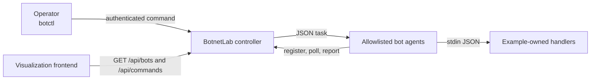

# BotnetLab

BotnetLab is a small, dependency-free command-and-status framework for botnet
demonstrations inside the SEED Emulator. It models the parts of a botnet that
are useful in teaching examples without including payload generation,
obfuscation, persistence, arbitrary remote shells, or post-exploitation tools.

BotnetLab is currently a source-tree tool. Examples copy the files they need
from this directory into their containers. If the API proves useful across
several examples, it can later become a SEED Emulator service.

## Components

- `controller.py` registers bots, distributes commands, records per-bot status,
  and provides read-only APIs for visualization.
- `agent.py` polls for tasks and executes only task names mapped at startup to
  fixed handler programs.
- `botctl.py` lists bots and commands and creates or cancels commands.
- `example_handler.py` demonstrates the handler contract without generating
  network traffic.
- `test_botnet_lab.py` exercises authentication and the complete task lifecycle.



## Security boundary

BotnetLab agents do not accept shell command strings from the controller. Every
allowed task is configured when the agent starts:

```sh
python3 agent.py \
  --controller http://10.150.0.66:8080 \
  --bot-id bot-001 \
  --handler udp_load=/opt/example/udp_load_handler.py
```

The controller may send a task named `udp_load`, but it cannot select a new
executable. The fixed handler receives task data as JSON on standard input.
Attack-specific validation, fixed destinations, rate limits, and duration limits
belong in that example-owned handler.

The default token is provided only for convenient isolated-lab use. A real
example should choose its own token and pass the same value to the controller,
agents, and `botctl`. Do not expose the controller's mutating API outside the
lab. Read-only status endpoints are public by default so a browser dashboard can
fetch them; use `--private-status` when that is undesirable.

## Local demonstration

Start the controller:

```sh
python3 controller.py --host 127.0.0.1 --port 8080 --token demo-token
```

Start two agents in separate terminals:

```sh
python3 agent.py --controller http://127.0.0.1:8080 --token demo-token \
  --bot-id bot-001 --asn 152 --handler demo=example_handler.py

python3 agent.py --controller http://127.0.0.1:8080 --token demo-token \
  --bot-id bot-002 --asn 160 --handler demo=example_handler.py
```

List bots and launch a harmless task:

```sh
python3 botctl.py --token demo-token bots

python3 botctl.py --token demo-token launch demo \
  --parameters '{"message":"hello bots","delay_seconds":0.5}'

python3 botctl.py --token demo-token commands
python3 botctl.py --token demo-token command COMMAND_ID --watch
```

The controller schedules the default command two seconds in the future. Agents
receive the same `start_at` timestamp, which helps distributed traffic handlers
begin at approximately the same time.

## Handler contract

An agent starts one handler process per assignment. For a `.py` handler it uses
the same Python interpreter that runs the agent. Other handler paths are executed
directly.

The handler receives one JSON object on standard input:

```json
{
  "command_id": "20e4cfb6079d",
  "task_type": "udp_load",
  "parameters": {
    "duration_seconds": 10,
    "packets_per_second": 200
  },
  "created_at": 1750000000.0,
  "start_at": 1750000002.0,
  "expires_at": 1750000120.0,
  "timeout_seconds": 60
}
```

It should return exit status zero for success and nonzero for failure. Standard
output and standard error are bounded and included in the assignment result.
The following environment variables are also set:

- `BOTNETLAB_BOT_ID`
- `BOTNETLAB_COMMAND_ID`
- `BOTNETLAB_TASK_TYPE`

Handlers must validate their parameters. BotnetLab deliberately does not turn
JSON parameters into command-line arguments or shell text.

## Controller APIs

Agent and operator endpoints require `Authorization: Bearer TOKEN`:

- `POST /api/register`
- `POST /api/heartbeat`
- `GET /api/tasks?bot_id=BOT_ID&wait=SECONDS`
- `POST /api/tasks/COMMAND_ID/status`
- `POST /api/commands`
- `POST /api/commands/COMMAND_ID/cancel`
- `POST /api/reset`

Read-only endpoints support CORS and are public unless `--private-status` is
used:

- `GET /api/bots`
- `GET /api/commands`
- `GET /api/commands/COMMAND_ID`
- `GET /healthz`

Cancellation prevents pending or delivered assignments from starting. It does
not forcibly terminate a handler that is already running; example handlers must
remain bounded and stop by themselves.

## Visualization integration

A browser can fetch BotnetLab status directly from a forwarded controller port,
alongside the existing Traffic Visualizer and health-probe APIs:

```text
http://localhost:8081/api/stats       victim traffic
http://localhost:8082/api/health      legitimate-client health
http://localhost:8083/api/bots        enrolled and active bots
http://localhost:8083/api/commands    command progress
```

This provides measured bot enrollment and execution state instead of inferring
the number of active bots from victim-side packet totals.

## Tests

The tests use only the Python standard library:

```sh
python3 -m unittest tools/BotnetLab/test_botnet_lab.py
```
