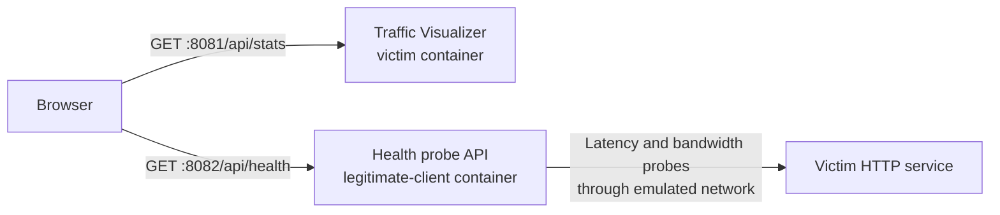

# Traffic Visualizer

Traffic Visualizer is a small, source-tree tool that counts packets and IPv4
bytes observed by `tcpdump` inside an emulated node and displays the totals in a
web browser. Byte counts use the IPv4 Total Length field, so they include the IP
header, transport header, and payload.

The tool is intentionally kept outside the `seedemu` Python package while it is
being developed. Examples load the shared files they need directly from this
directory and copy them into their containers. This means those examples must
be run from a SEED Emulator source checkout.

## Container requirements

- Python 3
- `tcpdump`
- permission to capture packets

## Example-owned configuration

Capture settings belong to each example, rather than to this shared directory.
A configuration file can also provide presentation settings and optional
example-owned extension assets:

```json
{
  "interface": "any",
  "capture_filter": "icmp or udp",
  "web_host": "0.0.0.0",
  "web_port": 8080,
  "frontend": {
    "title": "Example title",
    "subtitle": "Traffic arriving at the victim",
    "accent_color": "#38bdf8",
    "extension_js": "extension.js",
    "extension_css": "extension.css",
    "options": {
      "example_value": "available to the extension"
    }
  }
}
```

Extension paths are resolved relative to the configuration file. Both files
are optional; without them, the generic dashboard works by itself. The base
page loads the CSS and calls JavaScript hooks registered as follows:

```javascript
TrafficVisualizer.registerExtension({
  mount(context) {},
  update(stats, context) {},
  reset(context) {},
});
```

`context` contains the extension root element, `frontend.options`, API version,
and number/byte formatting helpers. Extension errors are contained in the
extension area so the generic counters continue to update. This small contract
lets an example add attack-specific explanations or derived values without
forking the capture agent or dashboard.

The emulator script should copy `traffic_visualizer.py`, `dashboard.html`, and
its configuration into the victim container, install Python and `tcpdump`,
start the visualizer, and optionally publish the configured web port on the
host.

## Optional victim-impact tools

Two additional shared programs measure whether legitimate clients can still
use a service during an attack:

- `victim_http_service.py` is a small synthetic service for examples that do
  not already have a suitable application to probe.
- `health_probe.py` runs on a separate legitimate-client node, measures any
  configured HTTP URL, stores a rolling history, and serves it to the browser.

For example:

```sh
python3 victim_http_service.py --port 8000

python3 health_probe.py \
  --target http://10.151.0.71:8000/health \
  --bandwidth-url http://10.151.0.71:8000/bandwidth \
  --serve-port 8080 --cors-origin '*'
```

The synthetic service's `/bandwidth?bytes=N` endpoint returns a bounded fixed
payload. When `--bandwidth-url` is configured, the probe periodically measures
application goodput in Mbps in addition to latency and reachability. Its
`--bandwidth-bytes`, `--bandwidth-interval`, and `--bandwidth-timeout` options
control the cost and frequency of that measurement.

The probe's `/api/health` endpoint returns the rolling measurement snapshot.
The example should forward the probe port to the Docker host and set
`frontend.options.health_api_port`. The shared dashboard then fetches packet
statistics from the victim and health measurements directly from the probe.
The probe includes CORS headers so those requests can use separate host ports.



The synthetic service is optional. An example with a real HTTP application can
point `health_probe.py` at that application instead. Target addresses, probe
intervals, warning thresholds, container placement, and frontend presentation
remain example-owned configuration.

## Runtime capacity controls

`network_control.py` uses Linux `tc` to apply an explicit egress rate limit at
runtime. It never applies a limit automatically and supports `set`, `status`,
and `clear`. An interface can be selected by name or by its subnet:

```sh
python3 network_control.py set --subnet 10.151.0.0/24 --rate 5mbit
python3 network_control.py status --subnet 10.151.0.0/24
python3 network_control.py clear --subnet 10.151.0.0/24
```

Because `tc` controls egress, applying it to the router interface facing the
victim limits traffic entering the victim network. `set` replaces the selected
interface's root qdisc; use it only when that interface does not contain
another link policy that must be preserved.

`container_control.py` runs on the Docker host and changes CPU or memory limits
with `docker update`. Before the first change it saves the original limits in a
local JSON file, which `restore` uses later:

```sh
python3 container_control.py set --container CONTAINER --cpus 0.5 --memory 256m --memory-swap 256m
python3 container_control.py show --container CONTAINER
python3 container_control.py restore --container CONTAINER
```

These privileged operations intentionally remain CLI-only and are not exposed
through Traffic Visualizer's HTTP API.

## HTTP endpoints

- `/` - dashboard
- `/api/stats` - current packet counters
- `/api/config` - frontend metadata and extension options
- `/api/reset` - reset counters with an HTTP `POST`
- `/extension.js` and `/extension.css` - optional example-owned assets
- `/healthz` - capture process status

The health probe provides these separate endpoints:

- `/api/health` - current legitimate-client health measurements
- `/api/reset` - reset the health history with an HTTP `POST`
- `/healthz` - probe API status

A successful health snapshot contains samples such as:

```json
{
  "success": true,
  "latency_ms": 12.4,
  "bandwidth_success": true,
  "throughput_mbps": 4.72,
  "downloaded_bytes": 262144
}
```

For a timeout or connection failure, a sample contains `{"success": false}`.
The browser combines this probe response with the victim's `/api/stats`
response before updating the example frontend extension.
